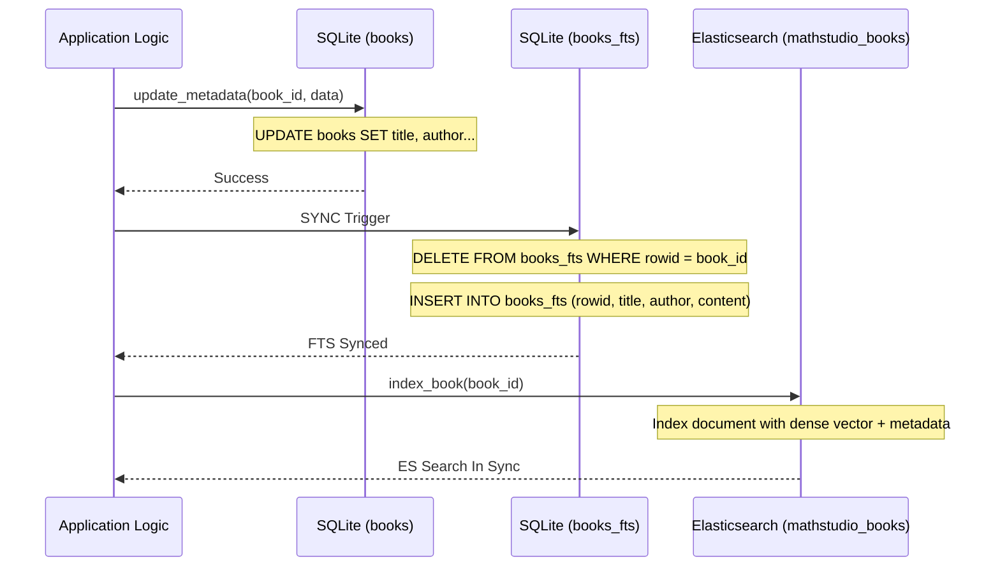

# Chapter 2: Relational Database & State Management

This chapter provides an exhaustive technical mapping of the MathStudio persistence layer. **Every method** in the database manager and library service is documented here.

## 1. The Database Manager (`core/database.py`)

The `DatabaseManager` class is the sole orchestrator for SQLite interactions. It enforces `STRICT` tables and `WAL` mode for high-concurrency research environments.

### Class: `DatabaseManager`

| Method | Signature | Rationale |
| :--- | :--- | :--- |
| `get_connection` | `() -> contextmanager` | **Critical Context Manager**. Enables `PRAGMA journal_mode=WAL` and `PRAGMA foreign_keys=ON` for every connection. Automates `rollback()` on failure. |
| `initialize_schema`| `(force_fts_rebuild=False)` | **Idempotent Bootstrapper**. Creates all 21+ tables and virtual indices. Handles 18+ schema migrations (adding columns like `zbl_id`, `trust_score`, `language`). |

### Schema Detail: The Life of a Book Record
The `books` table uses `STRICT` typing. Key state columns:
*   `metadata_status`: Controls reliability (`raw`, `verified`, `conflict`).
*   `index_version`: Tracks FTS sync state.
*   `trust_score`: AI-calculated probability of metadata correctness.

### Dataflow: Relational & FTS Synchronization
The following chart illustrates how metadata updates are propagated across the relational and search layers to ensure consistency without redundant text extraction.

### The Lifecycle of a Book Record
A document in MathStudio transitions through several relational states as the ingestion pipeline progresses:

1.  **Placeholder**: Created by `IndexerService.scan_library`. Minimal record (filename, size, hash).
2.  **Analyzed**: Populated by `UniversalProcessor`. Full metadata, ToC, and MSC codes are present.
3.  **Enriched**: `zbmath_service` has fetched official reviews. Dense vectors are generated.
4.  **Deep Indexed**: `IndexerService.deep_index_book` has extracted page-level text into `mathstudio_pages`.

---

## 2. Library & File Management (`services/library.py`)

The `LibraryService` handles the mapping between the physical filesystem (`LIBRARY_ROOT`) and the database state.

### Class: `LibraryService`

| Method | Signature | Detailed Implementation Logic |
| :--- | :--- | :--- |
| `calculate_hash` | `(file_path: str) -> str` | Generates a SHA-256 hash using 4KB block streaming to prevent memory spikes with large PDFs. |
| `check_duplicate` | `(file_hash, title, author)` | **Two-Tier Check**: 1. Exact hash match. 2. Semantic title/author fuzzy match (prefix-based clean title comparison). |
| `populate_missing_hashes`| `(limit: int) -> int` | Background utility to catch up on file hashing for legacy or manually moved files. |
| `delete_book` | `(book_id: int)` | **Safety Deletion**: Moves physical file to `_Admin/Archive/Deleted` before purging relational and FTS records. |
| `update_metadata` | `(book_id, data: dict)` | **State Sync**: Updates the `books` table and triggers a full `DELETE/INSERT` cycle on `books_fts` to maintain search synchronization. |
| `check_sanity` | `(fix: bool) -> dict` | **Integrity Audit**: Ranking candidates by path length (shorter = better) and location (unsorted = worse) to pick the 'redundant' records for deletion. |
| `get_book_by_path` | `(rel_path: str) -> dict` | Direct path-to-record resolver. |
| `clear_indexes` | `(book_ids: list)` | Resets `index_text` and `index_version` to trigger deep re-indexing. |
| `get_file_for_serving` | `(book_id: int)` | **On-the-Fly Conversion**: Resolves PDF path or triggers `ddjvu` to cache a PDF version of a DjVu file in `/static/cache/pdf`. |
| `find_language_mismatches`| `(limit: int) -> list` | Heuristic-based detection (checking for German indicators like "und", "der" in English titles). |
| `fix_language_mismatch`| `(book_id, preferred_title)` | Heuristic correction (restoring German titles from filenames). |
| `detect_book_language` | `(book_id: int) -> str` | **AI Validation**: Samples text from page 5 and 15, prompts Gemini for language identification. |

---

## 3. Data Integrity & FTS Synchronization

MathStudio maintains **three** parallel full-text indices that must be kept in sync by the methods above:
1.  **`books_fts`**: Metadata search (Synced by `update_metadata`).
2.  **`pages_fts`**: Raw OCR search (Synced by `IndexerService`).
3.  **`extracted_pages_fts`**: High-fidelity AI-LaTeX search (Synced by `IndexerService`).

### The FTS Sync Trigger Logic
When `update_metadata` is called, the system preserves the `content` (full text) in FTS while updating the `title`/`author` columns to prevent costly re-OCR of the entire book.
