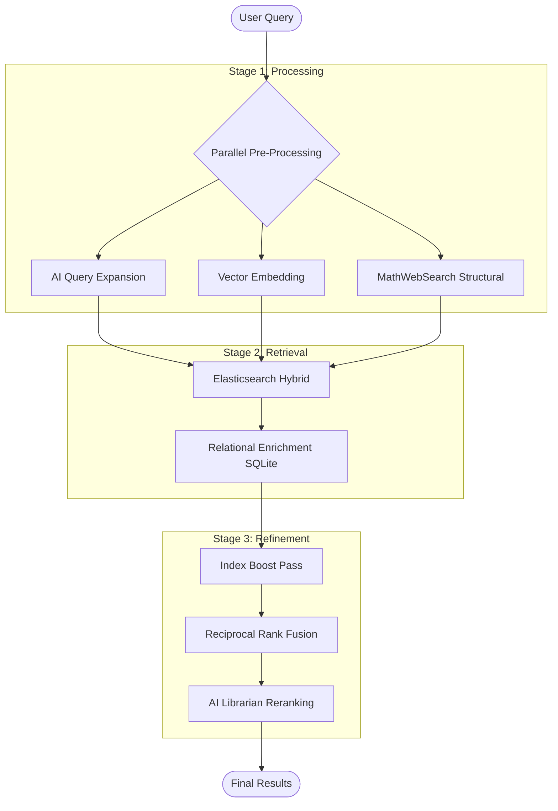

# Chapter 3: Search Engine Architecture (ES & MWS)

This chapter provides an exhaustive breakdown of the federated search system, including the Elasticsearch (ES) client, index mappings, and the search service orchestration.

## 1. Core Search Engine (`core/search_engine.py`)

The search engine layer manages the persistent index mappings and provides atomic indexing operations to the higher-level services.

### Global Client Configuration
The `es_client` is initialized with `retry_on_timeout=True` and `max_retries=3` to handle transient network issues in containerized environments. Security is disabled by default to simplify local research setups.

### Method Catalog: Index Management

| Method | Signature | Detailed Rationale & Logic |
| :--- | :--- | :--- |
| `create_mathstudio_indices` | `()` | **Bootstrap Routine**: Defines four core indices. Enforces specific analyzers (e.g., `english` for metadata, `standard` for authors). |
| `index_book` | `(book_data)` | Pushes a book record to `mathstudio_books`. ID-mapped to the SQLite `book_id`. |
| `index_page` | `(book_id, page_num, content)` | Pushes a raw text page to `mathstudio_pages`. Uses a flat document structure for fast retrieval. |
| `index_term` | `(term_data)` | Pushes a Knowledge Base term to `mathstudio_terms`, including its dense 768-dim vector. |

---

## 2. Search Service Orchestration (`services/search.py`)

The `SearchService` is the project's most complex component, implementing the **6-Stage Federated Search Pipeline**.

### Class: `SearchService`

| Method | Signature | Deep Dive: Implementation & Logic |
| :--- | :--- | :--- |
| `search` | `(query, ...)` | **Master Orchestrator**: Runs pre-processing (Expansion + MWS + Vector) in a `ThreadPoolExecutor` (max 3 workers). Fuses ES results with SQLite metadata. |
| `expand_query` | `(query) -> str` | **AI Expansion**: Prompts Gemini to translate to English and add mathematical synonyms. Uses `lru_cache(100)` to save API costs. |
| `get_embedding` | `(text) -> tuple` | Fetches 768-dim vector from Gemini. Explicitly configured for `task_type: RETRIEVAL_QUERY`. Cached via `lru_cache(100)`. |
| `convert_to_mathml` | `(latex) -> str` | Wraps `latexmlmath --cmml` in a subtree process. Critical for structural matching. |
| `search_mws` | `(latex_query)` | **Structural structural structural**: 1. Extracts variables `?a, ?b`. 2. Maps them to `mws:qvar` via BeautifulSoup. 3. Posts XML payload to MWS. 4. Returns term IDs. |
| `search_books_hybrid`| `(text, vec, ...)` | **Elasticsearch Logic**: Performs high-speed kNN (dense vector) + BM25 (multi_match) query. |
| `get_similar_books` | `(book_id) -> list` | **Pure Vector Discovery**: Fetches source embedding from ES and runs a kNN search for neighbors. |
| `search_within_book` | `(book_id, query)` | **Snippet Engine**: Uses ES `highlight` tags (`<b>...</b>`) over the `mathstudio_pages` index. |
| `extract_index_pages`| `(index_text, query)`| **RegEx Parser**: Scans back-of-book index strings for the query and extracts trailing page numbers/ranges using lookahead patterns. |
| `rerank_results` | `(query, cands)` | **The Librarian Pass**: LLM-driven filtering. Prompts Gemini to re-order the top 10 results based on "mathematical depth". |

---

### Dataflow: The 6-Stage Search Cascade
The following diagram illustrates the parallelized pre-processing and sequential refinement layers of the MathStudio search engine.

## 3. The 6-Stage Search Cascade (Step-by-Step)

The `search()` method executes the following logic:

1.  **Parallel Pre-processing**:
    *   `expand_query()`: Translates query if non-English.
    *   `get_embedding()`: Generates semantic vector.
    *   `search_mws()`: (Conditional) If query is LaTeX, search the structural index.
2.  **Hybrid Retrieval (ES)**:
    *   Executes a `bool` query combining `multi_match` (BM25) and `knn` (Cosine Similarity).
    *   Boost Profile: `title^4`, `index_text^3`, `toc^2`.
3.  **Relational Influx**:
    *   ES returns IDs; the service fetches full paths, ISBNs, and years from SQLite.
4.  **Index Boost Pass**:
    *   Calls `extract_index_pages()`. If query is found in the physical book index, score is boosted by `+0.5`.
5.  **Reciprocal Rank Fusion (RRF)**:
    *   Sorts results based on the aggregated ES score and index boosts.
6.  **AI Reranking (Final Pass)**:
    *   (Optional) If `use_rerank` is True, Gemini performs a semantic audit of the top results to ensure extreme relevance.
