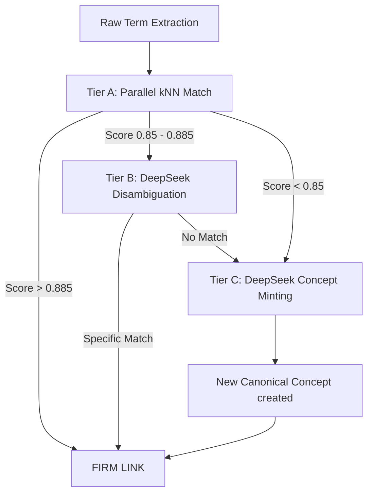

# Chapter 5: Knowledge Base & Semantic Anchoring

This chapter provides an exhaustive technical mapping of the MathStudio Knowledge Base (KB) and the Semantic Anchoring pipeline. It details how mathematical terms are extracted, clustered into canonical concepts, and indexed for federated search.

## 1. Knowledge Service (`services/knowledge.py`)

The `KnowledgeService` manages the lifecycle of mathematical terms (Theorems, Definitions, Examples) and implements the **Hybrid Semantic Search** logic.

### Class: `KnowledgeService`

| Method | Signature | Detailed Implementation Logic |
| :--- | :--- | :--- |
| `get_term` | `(term_id: int)` | Relational resolver. Joins `knowledge_terms` with `books` to provide full context (Title, Author, Path). |
| `sync_term_to_federated`| `(term_id: int)` | **Search Engine Sync**: 1. Pushes metadata to ES. 2. Extracts LaTeX blocks, converts to CMML via `latexmlmath`, and appends to `mathstudio.harvest` for MWS. |
| `update_term_status` | `(id, status)` | Transition manager (`draft` -> `approved`). Automatically triggers `sync_term_to_federated` upon approval. |
| `delete_term` | `(id)` | Purges record from SQLite and the `knowledge_terms_fts` virtual table. |
| `search_terms` | `(query, ...)` | **3-Pass RRF Search**: 1. Detects pure-LaTeX vs text. 2. Parallel pre-fetch of kNN Concepts + MWS formulas. 3. Manual Reciprocal Rank Fusion of BM25 and kNN hits. 4. Concept & MWS bonuses. |
| `browse_terms` | `(letter, sort, ...)` | Alphabetical browser with letter-count aggregation for the UI alphabet bar. |
| `search_concepts` | `(query)` | Two-stage canonical concept lookup: 1. Elasticsearch. 2. SQLite RegEx fallback. |

---

## 2. Anchoring Service (`services/anchoring.py`)

The `AnchoringService` implements the **Multi-Tier Clustering Pipeline** to reconcile millions of raw extracted terms into a clean ontology of canonical concepts.

### Class: `AnchoringService`

| Method | Signature | The 3-Tier Clustering Logic |
| :--- | :--- | :--- |
| `run_clustering` | `()` | **Pipeline Manager**: Orchestrates Tier A (Parallel ThreadPool) and Tier B/C (Sequential Queue) for all unlinked terms. |
| `_process_tier_a` | `(term: dict)` | **Tier A (Vector Matching)**: Uses kNN over `mathstudio_concepts`. Score >= 0.885 triggers automatic `LINKED`. 0.85-0.885 triggers `AMBIGUOUS`. |
| `tier_b_librarian` | `(term, candidates)`| **Tier B (LLM Disambiguation)**: Prompts **DeepSeek-Chat** at `temperature=0.0` to decisively pick the correct Concept ID from the ambiguous candidate list. |
| `tier_c_fallback` | `(term: dict)` | **Tier C (Ontology Generation)**: If no match exists, DeepSeek "mints" a new Canonical Concept (Clean Name, Subject Area, Summary). Updates SQLite and ES. |
| `vector_search_concepts`| `(emb, k=3)` | Raw kNN interface to the concept index. |

---

### Dataflow: Multi-Tier Semantic Anchoring
The anchoring process reconciles million-term extractions by checking them against a canonical "Ground Truth" ontology.

---

## 3. Disambiguation Logic: The "Librarian" Prompt

Tier B uses a specialized prompt that forces DeepSeek to act as a "mathematical ontology classifier." It contrasts the term's LaTeX statement against candidates like "Cauchy Sequence" vs "Convergent Sequence" to resolve semantic overlaps.

## 4. Federated Search Harmony (RRF)

The `search_terms` method implements a custom **Reciprocal Rank Fusion (RRF)** constant of `k=60`. It applies:
*   **CONCEPT_BONUS (+0.15)**: If a term belongs to a concept harvested in the initial kNN pass.
*   **MWS_BONUS (+0.20)**: If the term was matched by the MathWebSearch structural engine.
