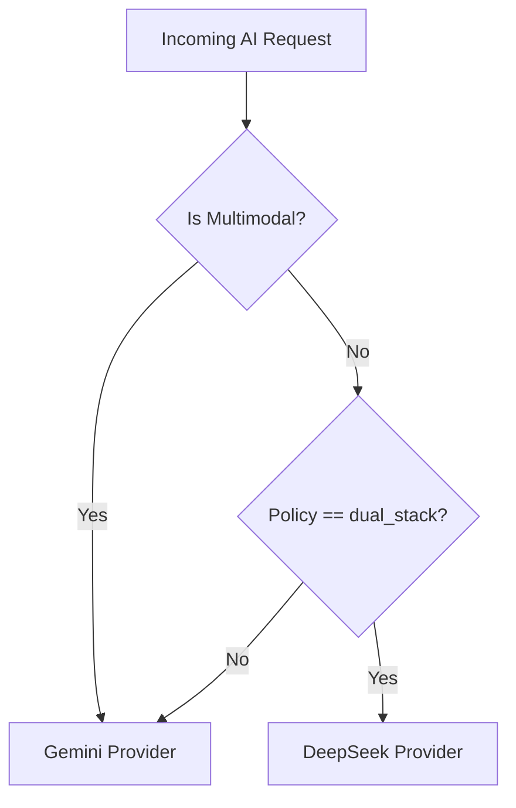

# Chapter 6: AI Integration & MCP Server

This chapter provides an exhaustive mapping of the MathStudio AI orchestration layer and the Model Context Protocol (MCP) interface.

## 1. AI Orchestration (`core/ai.py`)

MathStudio uses a **Dual-Stack AI Architecture** to balance the vision/long-context capabilities of Gemini with the high-speed reasoning of DeepSeek.

### Class: `GeminiProvider` (Primary)

| Method | Signature | Implementation Detail |
| :--- | :--- | :--- |
| `upload_file` | `(path, display_name)` | Direct integration with Gemini Files API. Returns a `file` object with a URI. |
| `generate_json` | `(contents, schema)` | **Reliability Logic**: 1. Enforces `response_mime_type: application/json`. 2. Implements a **Two-Stage Regex Repair** for malformed JSON strings (handling escaped backslashes in LaTeX). |
| `generate_text` | `(prompt)` | Standard text generation with exponential backoff (starting at 10s). |
| `generate_xml_blocks`| `(prompt, tag)` | Wraps results in specific XML delimiters to allow robust parsing of unstructured model outputs. |

### Class: `DeepSeekProvider` (Secondary)

| Method | Signature | Logic & Side Effects |
| :--- | :--- | :--- |
| `generate_json` | `(contents)` | Uses OpenAI-compatible SDK. Enforces `json_object` format. **Critical**: Only used for text-only prompts (no multimodal support). |
| `_to_string_prompt` | `(contents)` | Aggregator method that flattens Gemini-style `types.Content` objects into raw strings for DeepSeek compatibility. |

### The `AIService` Router (The Brain)

| Method | Signature | Routing Rationale |
| :--- | :--- | :--- |
| `_is_multimodal` | `(contents) -> bool` | Detects if the prompt contains file URIs or inline bytes. |
| `generate_json` / `_text` | `(contents, ...)` | **The Routing Rule**: If `AI_ROUTING_POLICY` is `dual_stack` AND the request is NOT multimodal AND DeepSeek is available -> Route to DeepSeek. Otherwise -> Route to Gemini. |

---

### Dataflow: The AI Routing Policy
The `AIService` orchestrates which model handles a request based on the data type and the user's performance needs.

### JSON Precision: The LaTeX Repair Logic
Mathematical extractions often break standard JSON parsers due to unescaped backslashes in LaTeX (e.g., `\frac`). MathStudio implements a **Two-Stage Repair Protocol** in `GeminiProvider.generate_json`:
1.  **Direct Escape**: Uses `re.sub(r'\\(?!["\\/]|u[0-9a-fA-F]{4})', r'\\\\', text)` to double-escape backslashes that aren't already part of a valid JSON escape sequence.
2.  **Brute Normalization**: If the first stage fails, the provider replaces all `\` with `\\` and then restores valid JSON quotes `\"` to ensure structural validity.

---

## 2. MCP Server (`mcp_server/server.py`)

The MCP Server acts as a bridge for external AI agents to use MathStudio as a toolset.

### Core Tool Catalog

| Tool Name | Service Hook | Exhaustive Logic |
| :--- | :--- | :--- |
| `search_books` | `search_service.search` | Primary entrance for agentic discovery. |
| `read_pdf_pages` | `PDFHandler` | Slices absolute PDF pages and returns them as URIs for LLM inspection. |
| `search_kb` | `knowledge_service.search`| Semantic search over mathematical terms. |
| `create_note` | `NoteService` | Creates and optionally compiles research notes. |
| `get_book_details`| `LibraryService` | Returns full metadata, MSC classes, and indexing status. |

---

## 3. RAG Workflows & Protocols

MathStudio defines several "System Prompts" within the MCP server:
*   **Usage Manifesto**: Teaches the agent how to navigate the 6-stage search cascade.
*   **Deep Research Workflow**: A multi-step protocol for extracting theorems from one book and verifying them in another.

## 4. Error Handling & Rate Limiting

The AI layer implements a global `retry_count` (default 5 for JSON, 3 for text) with linear backoff. All raw model outputs are logged to `ai_debug_raw.log` for developer auditing of potential hallucination patterns.
