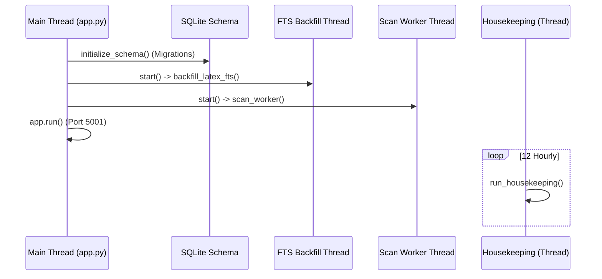
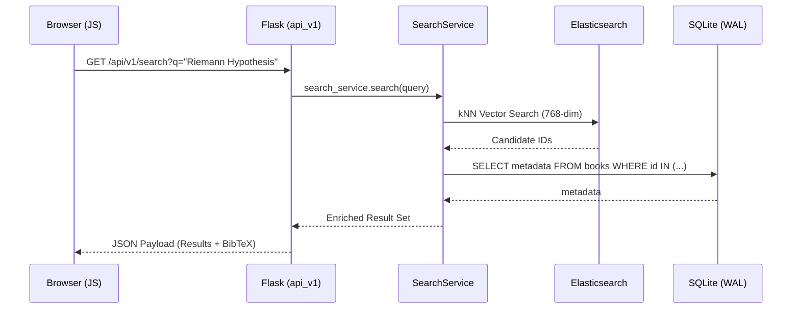

# Chapter 7: API Reference & Web Architecture

This chapter provides an exhaustive mapping of the MathStudio Web Interface and REST API. It details every endpoint, its expected parameters, and the internal service calls it triggers.

## 1. REST API (`api_v1.py`)

The API follows a strict RESTful pattern under the `/api/v1` namespace.

### Discovery & Search Endpoints

| Endpoint | Method | Parameters | Exhaustive Logic |
| :--- | :--- | :--- | :--- |
| `/search` | `GET` | `q`, `limit`, `offset`, `fts`, `vec`, `trans`, `rank` | **Federated Gate**: Orchestrates `search_service.search`. Enriches results with `bib_key` and `bibtex` on-the-fly. |
| `/search/vector`| `GET` | `q`, `limit` | **Semantic discovery**: Bypasses expansion, runs pure kNN via `search_service.get_embedding`. |
| `/browse` | `GET` | `author`, `msc`, `year`, `keyword` | **Relational Filter**: Constructs a multi-clause SQL query with `%` wildcard flanking for flexible author matching. |
| `/msc-stats` | `GET` | *None* | **Analytics**: Aggregates MSC codes into 2, 3, and 5-digit frequency buckets for UI heatmaps. |

### Book & Content Management

| Endpoint | Method | Parameters | Logic |
| :--- | :--- | :--- | :--- |
| `/books/<id>` | `GET` | *None* | **Detail Resolver**: Joins `books` with `zbmath_cache` to provide reviews and MSC code. |
| `/books/<id>/deep-index` | `POST` | *None* | Triggers `indexer_service.deep_index_book`. Synchronous. |
| `/books/<id>/toc` | `GET` | *None* | Returns the recursive JSON structure from `toc_json`. |
| `/books/<id>/reindex`| `POST` | `mode` (auto/toc/index) | Triggers vision-OCR for either the Table of Contents or the Back-of-Book Index. |
| `/books/latex` | `GET` | `pages`, `refresh` | **Vision Pipeline**: Triggers `pipeline_service.run_pass_1` for high-fidelity OCR. |

### Note & KB Management

| Endpoint | Method | Logic |
| :--- | :--- | :--- |
| `/notes` | `POST` | Creates Markdown/LaTeX note and triggers `compilation_service.compile_note` for PDF output. |
| `/knowledge/search`| `GET` | Orchestrates the 3-pass RRF search in `KnowledgeService`. |
| `/notes/compile` | `POST` | Triggers a full library compilation (Category/Master PDFs). |

---

## 2. Web Application (`app.py`)

The Flask application serves as the glue between the HTML templates and the Python services.

### Core Architecture
*   **Template Filters**: 
    *   `from_json`: Safely parses SQL strings for UI rendering.
    *   `read_file_content`: Dynamically injects Markdown/LaTeX into view templates.
*   **State Management**: `update_state(action, **kwargs)` writes to `current_state.json` allowing external agents (e.g. via MCP) to "see" what the user is currently doing.

### Background Workers
MathStudio spawns two critical daemon threads at startup:
1.  **FTS Backfill**: Runs `note_service.backfill_latex_fts()` to ensure all cached Vision OCR data is searchable via SQLite FTS5.
2.  **Scan Worker**: Runs `note_service.scan_worker()` to process full-book OCR requests sequentially without blocking the UI.

### Housekeeping Job
`run_housekeeping()` (scheduled task):
*   **Wishlist Deduplication**: Uses `rapidfuzz` (threshold > 85) to mark wishlist items as "acquired" if they appear in the library.
*   **DOI-to-Zbl Bridge**: Periodic replenishment of missing Zbl IDs using `zbmath_service`.

### Dataflow: System Boot & Worker Sequence
At startup, MathStudio initializes the database schema and spawns parallel threads to handle maintenance and long-running OCR tasks.

## 3. Data Flow Chart (Frontend-to-Backend)

